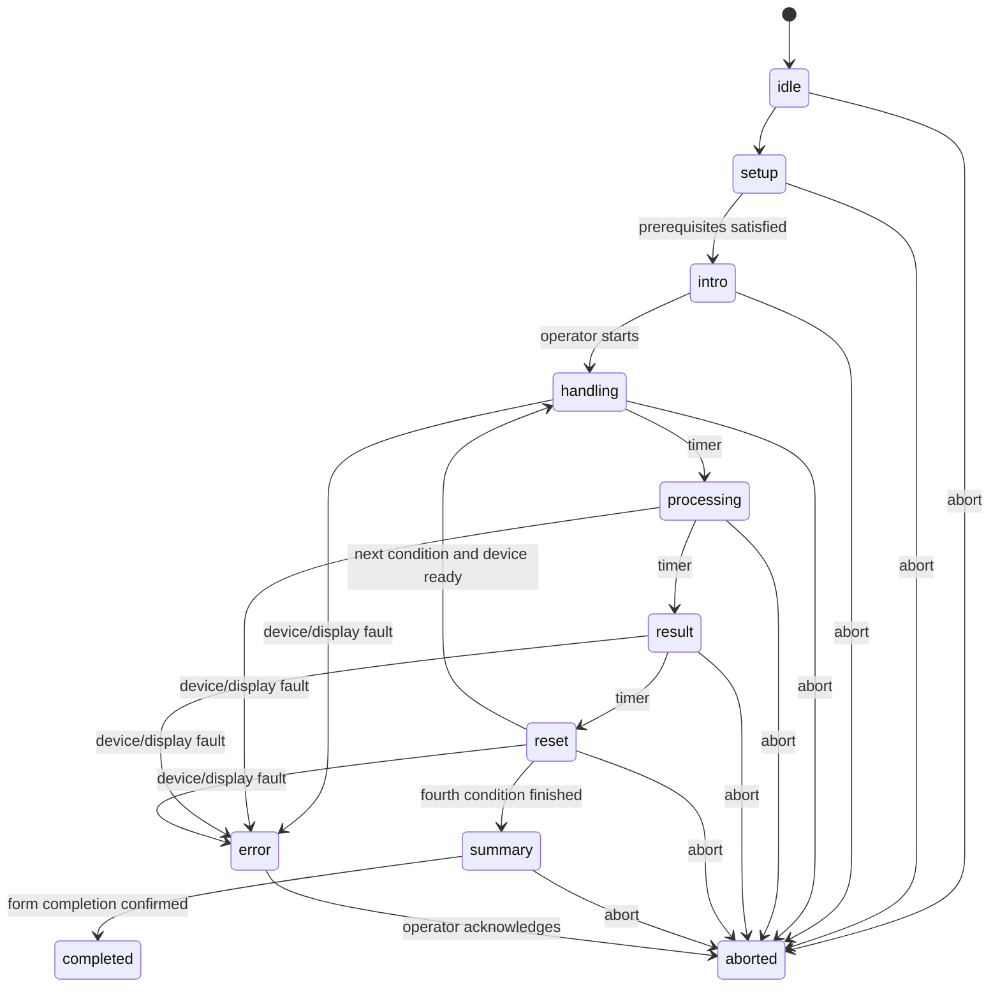

# 実験用ローカルWebアプリ 完全仕様書

## 1. プロジェクトの目的

身体状態の外化方法について、同一の身体状態データを次の2要因で提示し、参加者の受け止め方を比較する。

- 処理場所：クラウド / この端末内
- 伝え方：状態ラベル / フグ型デバイスのふくらみ

このアプリは、参加者へ4条件を正確かつ再現可能に提示し、研究スタッフが安全に進行するためのものである。

このアプリは診断システムではない。ストレスや健康状態を医学的に判定しない。参加者が同じ身体状態の提示をどう意味づけるかを評価するための実験提示システムである。

## 2. 今回のスコープ

### 実装する

- 研究スタッフ用進行画面
- 参加者用全画面表示
- 4条件の提示
- バランスされた提示順
- 固定身体状態データ
- 実験タイマー
- MockDevice
- USBシリアル実機アダプタ
- ローカルログ
- CSVエクスポート
- 異常停止・復旧
- アンケートへ戻る案内
- 運用ドキュメントとテスト

### 実装しない

- Googleフォームそのもの
- Googleフォーム回答の取得
- 同意文書の再実装
- 外部クラウドへのデータ送信
- Firebase
- 実際の管理者閲覧機能
- 実際の身体データの収集
- Fitbit、心拍、RMSSDの本番連携
- 診断・健康助言
- 研究仮説の参加者向け表示
- 顔、音声、映像、位置情報の取得
- 参加者が自分だけで実験を進めるセルフサービス機能

実センサ連携が後日必要になった場合は、別のプロトコルバージョンとして追加する。今回のMVPでは固定データを唯一の入力とする。

## 3. 実験設計

### 3.1 条件定義

| 内部コード | 処理場所 | 伝え方 | 左パネル | 右パネル |
|---|---|---|---|---|
| A | cloud | label | クラウド設定 | 状態指標＋状態ラベル |
| B | local | label | 端末内設定 | Aと完全に同じ |
| C | local | puffer | 端末内設定 | フグへの反映 |
| D | cloud | puffer | クラウド設定 | Cと完全に同じ |

条件定義はコード上で`as const`として固定し、参加者向けラベルと分離する。

```ts
export const CONDITIONS = {
  A: { processing: "cloud", presentation: "label" },
  B: { processing: "local", presentation: "label" },
  C: { processing: "local", presentation: "puffer" },
  D: { processing: "cloud", presentation: "puffer" },
} as const;
```

### 3.2 提示順

使用する順序は次の4つ。

- ABDC
- BCAD
- CDBA
- DACB

これは、各条件が第1〜第4位置へ1回ずつ現れ、4順序全体で12種類の直前→直後ペアを1回ずつ含む。

自動割付では、完了済みセッション数が最も少ない順序を優先する。同数の場合のみ暗号学的乱数または十分な乱数で選ぶ。中断セッションを割付数へ含めるかは設定可能とし、デフォルトでは「条件提示を1回でも開始した中断セッションは含める」。

手動選択も可能とするが、偏り警告を表示する。

### 3.3 固定身体状態データ

デフォルト：

- 内部スコア：72
- ラベル：高ストレス
- フグ正規化目標レベル：0.60

内部スコアはセッション開始時にコピーされ、そのセッションでは変更不可とする。A/Bは同じ数値とラベルを使い、C/Dは同じ正規化レベル、膨張時間、保持時間、収縮時間を使う。

「72」と「0.60」の対応は実験設定で固定する。ソフトウェアが物理圧力を直接決定してはならない。

## 4. 想定運用

- 研究スタッフのPCでローカルサーバを起動
- 同じPCの別ウィンドウ、または外部ディスプレイで参加者画面を表示
- 参加者は自分のスマートフォンで既存Googleフォームを開く
- Googleフォーム上で研究説明と同意を完了
- スタッフが同意済みを確認
- スタッフ画面で研究用IDと提示順を設定
- 4条件を自動提示
- 最後に参加者画面へ4提示のサマリーを表示
- 参加者はスマートフォンのGoogleフォームへ戻り、11問へ回答
- スタッフが回答完了を確認し、セッションを完了
- 必要に応じてローカルログをCSV出力

## 5. 画面構成

## 5.1 参加者画面

対象：

- 横長16:9
- 1366×768以上
- フルスクリーン
- スクロールなし
- マウス操作なし

全画面共通：

- 背景：`#F6F7F9`
- 本文：`#172033`
- 見出し：`#245AA6`
- カード：白
- 枠：`#D8DDE6`
- 補助背景：`#EEF1F5`
- 危険を暗示する赤・安全を暗示する緑を条件表示に使用しない
- フォント：`Noto Sans JP`, `BIZ UDPGothic`, `Yu Gothic`, sans-serif
- 外部フォント読込禁止
- 共通導入、フェーズ案内、結果、サマリーの主要内容は、利用可能な表示領域の中央を基準に配置し、片側だけに大きな空白を残さない
- 装飾だけを目的とする同心円、軌道、浮遊点、グラデーション、影、英語の小見出しを使用しない
- 日本語の情報階層、罫線、余白で構造を示し、研究表示に不要なAI風の視覚モチーフを加えない
- 1366×768と1920×1080の双方で、主要内容の中心が表示領域の中心から大きく外れないことを自動テストする

基準レイアウト：

```text
┌──────────────────────────────────────────────────────────┐
│ 第1提示 / 4                       同じ身体データを使用中 │
├──────────────────────┬───────────────────────────────────┤
│ この提示の             │ 現在の状態                       │
│ データ取扱い設定       │                                   │
│                       │ 条件に応じて                       │
│ 処理場所               │ ・状態指標＋状態ラベル           │
│ 保存                   │ ・フグ型デバイスへの反映         │
│ 閲覧範囲               │                                   │
├──────────────────────┴───────────────────────────────────┤
│ 比較用シナリオ｜この表示は医療上の診断ではありません   │
└──────────────────────────────────────────────────────────┘
```

比率：

- ヘッダー：高さ72px
- 本文：左42%、右58%
- フッター：高さ56px
- 外余白：32px
- カード間隔：24px

最低文字サイズ：

- 主結果：48px
- 数値：64px
- パネル見出し：26px
- 行見出し：20px
- 行値：28px
- フッター：18px

### 5.1.1 共通導入

参加者画面へ次を表示する。具体的文言は`UI_COPY.md`を使用。

- 同じ身体状態データを4つの方法で提示する
- 変化するのは処理場所と伝え方
- 比較用シナリオであり、実際にクラウド送信しない
- 正解を選ぶ課題ではない
- それぞれの感じ方を覚える
- 共通場面：「少し本調子ではないまま作業を続けている」

スタッフが「開始」を押すまで進まない。

### 5.1.2 条件画面：左パネル

見出し：

`この提示のデータ取扱い設定`

クラウド：

| 項目 | 値 |
|---|---|
| 処理場所 | クラウド |
| 保存 | サーバに保存 |
| 閲覧範囲 | 本人・所属先の管理者 |

ローカル：

| 項目 | 値 |
|---|---|
| 処理場所 | この端末内 |
| 保存 | 保存しない |
| 閲覧範囲 | 本人のみ |

各行に単色線画アイコンを置いてよい。

- 処理場所：cloud / device icon
- 保存：database icon
- 閲覧範囲：eye icon

ただしアイコンの色、大きさ、線幅は共通にする。

処理場所行では、クラウド条件にcloud icon、ローカル条件にdevice iconを必ず表示する。両者の色、大きさ、線幅、占有枠、配置は同一にし、値の文字サイズとウェイトも同一にする。処理場所の値は保存・閲覧範囲より大きくしてよいが、cloud/local間では同一のタイポグラフィを使用する。

### 5.1.3 条件画面：右パネル

ラベル条件：

```text
現在の状態

状態指標
72 / 100

高ストレス
```

AとBでDOM構造、文字、位置、サイズ、表示開始時刻を同一にする。

フグ条件：

```text
現在の状態

状態はフグ型デバイスに
反映されています
```

同時に実機またはMockDeviceへ膨張命令を送る。

CとDでDOM構造、文字、位置、サイズ、装置命令、膨張量、速度、保持時間を同一にする。

画面内に簡単な矢印を出して実機の設置方向を示してよい。ただし全フグ条件で同じにする。

### 5.1.4 処理中

4条件共通：

```text
身体データを処理しています…
```

同じスピナー、同じ3秒を使用する。クラウドだけ遅くしてはならない。

### 5.1.5 リセット

4条件共通：

```text
次の提示に移ります
```

フグ条件後は、収縮完了のACKを受信してから次へ進む。ACKが来ない場合はerrorへ移行する。

### 5.1.6 サマリー

4提示終了後：

- 第1〜第4提示の小カードを横並びまたは2×2で表示
- 各カードには、参加者が見た処理場所と伝え方を短く表示
- 内部コードA/B/C/Dは表示しない
- 固定数値は表示してよい
- 仮説や良し悪しは表示しない
- Googleフォームへ戻る案内
- `formUrl`がある場合のみQRを生成
- QR生成はローカルライブラリで行い、外部サービスを使用しない

## 5.2 スタッフ画面

### セットアップ

必須項目：

- 研究用ID
- 同意確認済みチェック
- 提示順：自動割付 / 手動
- 固定スコア
- ラベル
- フグ目標レベル
- Device mode
- 参加者画面接続状態
- 装置接続状態
- 設定バージョン
- プロトコルバージョン

研究用ID：

- デフォルト正規表現：`^SH26-[0-9]{3}$`
- 例：`SH26-001`
- 既存ID重複時は警告し、通常は開始不可

開始条件：

- 同意確認済み
- 有効な研究用ID
- 提示順確定
- 参加者画面接続済み
- 装置ready
- フグがidle/deflated
- 設定検証成功

### 実験中

表示：

- 第何提示か
- 内部条件コード
- 処理場所
- 伝え方
- 現在フェーズ
- 残り時間
- 固定スコア
- デバイス状態
- 参加者画面接続
- 直近イベント
- 縮小プレビュー

操作：

- 開始
- 中止
- 緊急停止
- 再接続
- 参加者画面をフルスクリーンへ
- ログ確認

通常進行中に「次へ」を手動連打できないようにする。自動進行を基本とし、研究スタッフが変動させられる時間を最小化する。

### 完了

- 4提示終了
- Googleフォーム回答を案内済み
- 回答完了確認
- セッション完了
- ログ出力
- 次の参加者へリセット

## 5.3 デバイステスト画面

本番セッションと明確に分ける。

機能：

- 接続
- PING
- STATUS
- 設定上限以下の膨張テスト
- 収縮
- STOP
- 直近ACK
- エラー表示
- Mock/Serialの明示

本番セッション中は開けない。

## 6. タイミング

デフォルト：

| フェーズ | 時間 |
|---|---:|
| データ取扱い確認 | 8,000ms |
| 処理中 | 3,000ms |
| 結果提示 | 15,000ms |
| リセット | 7,000ms |

フグ動作：

- 膨張ランプ：6,000ms
- 保持：結果提示終了まで
- 収縮ランプ：6,000ms

サーバがフェーズ開始時刻と終了予定時刻を保持する。参加者画面は残り時間を計算して描画するだけとし、画面側の`setTimeout`だけで状態を決定しない。

スタッフ向けには残り時間を表示してよい。参加者向けには秒数カウントダウンを表示しない。

## 7. ステートマシン



不正な遷移はHTTP 409またはドメインエラーとして拒否する。

## 8. サーバと同期

サーバを唯一の状態源とする。

### REST例

- `POST /api/sessions`
- `GET /api/sessions/:id`
- `POST /api/sessions/:id/start`
- `POST /api/sessions/:id/abort`
- `POST /api/sessions/:id/emergency-stop`
- `POST /api/sessions/:id/confirm-form-complete`
- `DELETE /api/sessions/:id`
- `GET /api/exports/sessions.csv`
- `POST /api/device/connect`
- `POST /api/device/disconnect`
- `POST /api/device/stop`
- `GET /api/device/status`

### WebSocket

サーバ→画面：

- `session.snapshot`
- `session.phaseChanged`
- `session.completed`
- `session.aborted`
- `session.error`
- `device.status`
- `display.command`

画面→サーバ：

- `display.ready`
- `display.fullscreenState`
- `display.heartbeat`

参加者画面は状態変更コマンドを送れない。

## 9. 設定

起動時にJSONを読み込み、スキーマ検証する。検証失敗時は実験を開始せず、スタッフ画面へ原因を表示する。

変更不可の例：

- 条件対応
- UI文言キー
- 順序集合

変更可能だがバージョン管理する例：

- 固定スコア
- フグ目標レベル
- 時間
- GoogleフォームURL
- 研究用ID形式

設定のSHA-256ハッシュをセッションログへ記録する。

## 10. ログ

### 保存形式

1セッション1ファイルのJSON Lines。

例：

`data/sessions/2026-07-24/SH26-001_<session-id>.jsonl`

`data/`はGit管理外。

### 許可フィールド

```ts
type ExperimentLogEvent = {
  schemaVersion: 1;
  protocolVersion: string;
  appVersion: string;
  configHash: string;
  sessionId: string;
  researchId: string;
  orderCode: "ABDC" | "BCAD" | "CDBA" | "DACB";
  sequenceIndex?: 0 | 1 | 2 | 3;
  conditionCode?: "A" | "B" | "C" | "D";
  processing?: "cloud" | "local";
  presentation?: "label" | "puffer";
  phase: string;
  eventType: string;
  wallClockIso: string;
  monotonicMs: number;
  fixedScore: number;
  pufferLevel: number;
  deviceMode: "mock" | "serial";
  deviceStatus?: string;
  result?: "ok" | "aborted" | "error";
  errorCode?: string;
};
```

禁止フィールド：

- 氏名
- メール
- 学籍番号
- IP
- User-Agent全文
- 位置情報
- Googleフォーム回答
- 自由記述
- 生体データ

CSVは1セッション1行のサマリーとする。

## 11. デバイス抽象化

```ts
export interface PufferDevice {
  connect(): Promise<void>;
  disconnect(): Promise<void>;
  ping(): Promise<DeviceStatus>;
  getStatus(): Promise<DeviceStatus>;
  inflate(input: {
    level: number;
    rampMs: number;
    requestId: string;
  }): Promise<DeviceAck>;
  deflate(input: {
    rampMs: number;
    requestId: string;
  }): Promise<DeviceAck>;
  stop(input: { requestId: string }): Promise<DeviceAck>;
}
```

MockDevice：

- 実時間モードと高速テストモード
- 状態遷移を再現
- ACK遅延、切断、エラーを注入可能
- 参加者画面に小さな開発用シミュレーションを出してよいが、本番では非表示
- Operatorには常にMockであることを明示

SerialDevice：

- 改行区切りJSON
- ACKのrequestId照合
- タイムアウト
- 不正応答拒否
- 切断検知
- STOP優先
- 再接続

## 12. 障害時の振る舞い

### 参加者画面切断

- 1秒以内の一時切断：再接続を試行
- 規定時間超過：フェーズ停止、装置STOP/DEFLATE、セッションerror
- 参加者画面は再接続後に中断画面を表示

### 装置切断

- 即時STOP試行
- DEFLATE試行
- セッションerror
- 以後の提示を行わない
- スタッフへ明確な手順を表示

### ブラウザ更新

- サーバの状態を再取得
- 実験中なら勝手にタイマーを再開せず、Operatorへ復旧確認
- Participantには中立な「研究スタッフの案内をお待ちください」
- 復旧を選んだ場合のみ、サーバ時刻に基づいて再開
- 復旧できない場合は中断

### 緊急停止

- Operatorの大きな固定ボタン
- キーボードショートカットは誤操作しにくい組合せ
- 押下直後にSTOP
- Participantを中断画面へ
- セッションは再開不可
- 新しいセッションを作るまで装置操作を制限

## 13. セキュリティ

- デフォルトbind：`127.0.0.1`
- LAN公開は明示的フラグが必要
- LAN時はランダムなOperator tokenを要求
- CORSを開放しない
- CSPを設定
- `connect-src 'self' ws:`
- 外部画像・スクリプト・フォント禁止
- HTMLを動的注入しない
- 設定パスのパストラバーサル防止
- ログの改行・CSV injection対策
- フォームURLは許可されたHTTPS URLだけ
- リンクは参加者の明示操作で開く
- 自動リダイレクトしない

## 14. 推奨リポジトリ構成

```text
.
├── AGENTS.md
├── README.md
├── package.json
├── package-lock.json
├── .env.example
├── config/
│   └── experiment.json
├── docs/
│   ├── EXPERIMENT_SPEC.md
│   ├── UI_COPY.md
│   ├── DEVICE_PROTOCOL.md
│   ├── RUNBOOK.md
│   ├── TEST_REPORT.md
│   └── PROTOCOL_CHANGELOG.md
├── src/
│   ├── client/
│   │   ├── operator/
│   │   ├── participant/
│   │   ├── device-test/
│   │   └── shared/
│   ├── server/
│   │   ├── api/
│   │   ├── websocket/
│   │   ├── sessions/
│   │   ├── devices/
│   │   ├── logging/
│   │   └── security/
│   └── shared/
│       ├── conditions.ts
│       ├── experiment-machine.ts
│       ├── schemas.ts
│       └── copy.ts
├── tests/
│   ├── unit/
│   ├── integration/
│   └── e2e/
├── artifacts/
│   └── screenshots/
└── data/
    └── .gitkeep
```

## 15. 必須テスト

### ドメイン

- 条件対応
- 4順序
- 位置バランス
- ペアバランス
- 自動割付
- 中断のカウント方針
- 固定値ロック
- 不正状態遷移拒否

### UI

- 参加者画面に内部コードなし
- A/B右パネル同一
- C/D右パネル同一
- cloud/localで色テーマが変わらない
- 文言がUI_COPYと一致
- 1366×768、1920×1080でスクロールなし
- サマリーの順序が実際の提示順と一致

### 装置

- Mockの正常系
- ACKタイムアウト
- 切断
- STOP優先
- DEFLATE
- C/D命令同一

### ネットワーク

Playwrightで外部URLへのrequestを監視し、localhost以外への自動通信が1件でもあれば失敗させる。フォームリンクの手動クリックは別テストとする。

### E2E

4順序すべてを高速MockDeviceで完走する。

各E2Eで確認：

- 全フェーズ
- 画面文言
- ログ
- サマリー
- 完了
- 異常なし

障害E2E：

- 結果提示中の装置切断
- 参加者画面切断
- 緊急停止
- ブラウザ更新
- 重複研究用ID

## 16. 受け入れ基準

- `npm install && npm run build && npm run start`で起動
- MockDeviceだけで全実験を実演可能
- 2つのブラウザウィンドウが同期
- 参加者画面に操作UIなし
- 同一固定値が4条件へ使われる
- A/Bの右表示が同一
- C/Dの装置動作が同一
- 外部自動通信なし
- 全ログが研究用IDで対応
- PIIなし
- 緊急停止が動作
- 全テスト成功
- READMEだけで第三者が起動可能
- RUNBOOKだけで研究スタッフが運用可能
- Playwrightスクリーンショットでデザイン確認可能

## 17. 本番前に人が確認するもの

ソフトウェアテストだけでは完了としない。RUNBOOKへ次を入れる。

- 実機の最大膨張上限
- 物理緊急停止
- 配線
- 空気漏れ
- 収縮完了
- 会場照明
- 表示距離
- フォント可読性
- Googleフォーム
- QR
- 研究用ID
- 提示順
- 同意
- 15分以内
- 参加者3〜5名のパイロット
- iPhone/Androidでフォーム確認
- 研究責任者による最終文言確認
