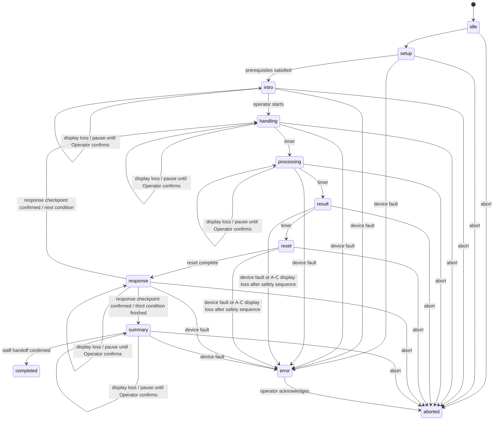

# 実験用ローカルWebアプリ 完全仕様書

## 1. プロジェクトの目的

身体状態の外化方法について、参加者本人を測定したものではない同一の固定模擬データを次の3条件で提示し、参加者の受け止め方を比較する。

- クラウドで処理し、状態ラベルで示す
- この端末内で処理し、同じ状態ラベルで示す
- この端末内で処理し、画面上のフグのふくらみで示す

このアプリは、参加者へ3条件を正確かつ再現可能に提示し、各提示直後のアプリ外回答チェックポイントを含めて研究スタッフが安全に進行するためのものである。正式MVPのプロトコルは`R8-010-3condition-screen-v1`とする。

このアプリは診断システムではない。ストレスや健康状態を医学的に判定しない。参加者が同じ身体状態の提示をどう意味づけるかを評価するための実験提示システムである。

## 2. 今回のスコープ

### 実装する

- 研究スタッフ用進行画面
- 参加者用全画面表示
- 3条件の提示
- バランスされた提示順
- 固定模擬データ（本人の測定値ではない）
- 実験タイマー
- 画面上のフグ表示
- ScreenPufferDevice
- MockDevice
- ローカルログ
- CSVエクスポート
- 異常停止・復旧
- 各提示後の中立な回答チェックポイント
- 3提示後の中立なスタッフ引継ぎ案内
- 運用ドキュメントとテスト

### 実装しない

- 外部アンケートの名称、URL、リンク、QRコード
- フォームその他の外部アンケート回答の取得、表示、送信、完了確認
- 同意文書の再実装
- 外部クラウドへのデータ送信
- Firebase
- 実際の管理者閲覧機能
- 実際の身体データの収集
- 心拍その他の生体データの取得
- Fitbit、心拍、RMSSDの本番連携
- USBシリアル実機を用いた物理フグの提示
- 診断・健康助言
- 研究仮説の参加者向け表示
- 顔、音声、映像、位置情報の取得
- 参加者が自分だけで実験を進めるセルフサービス機能

実センサ連携または物理フグが後日必要になった場合は、研究責任者の承認と所属機関で必要な倫理審査・変更手続きを経た別のプロトコルバージョンとして追加する。今回のMVPでは固定模擬データを唯一の入力とし、`device.mode=screen`だけを正式実施に使用する。既存の`SerialPufferDevice`境界は将来用として保守してよいが、このプロトコルの刺激へ混在させない。

## 3. 実験設計

### 3.1 条件定義

| 内部コード | 処理場所 | 伝え方 | 左パネル | 右パネル |
|---|---|---|---|---|
| A | cloud | label | クラウド設定 | 状態指標＋状態ラベル |
| B | local | label | 端末内設定 | Aと完全に同じ |
| C | local | puffer | 端末内設定 | 画面上のフグへの反映 |

条件定義はコード上で`as const`として固定し、参加者向けラベルと分離する。

```ts
export const CONDITIONS = {
  A: { processing: "cloud", presentation: "label" },
  B: { processing: "local", presentation: "label" },
  C: { processing: "local", presentation: "puffer" },
} as const;
```

### 3.2 提示順

使用する順序は3条件の全順列である次の6つ。

- ABC
- ACB
- BAC
- BCA
- CAB
- CBA

これは、各条件が第1〜第3位置へ2回ずつ現れ、6順序全体で6種類の直前→直後ペアを2回ずつ含む。

自動割付では、完了済みセッション数が最も少ない順序を優先する。同数の場合のみ暗号学的乱数または十分な乱数で選ぶ。中断セッションを割付数へ含めるかは設定可能とし、デフォルトでは「条件提示を1回でも開始した中断セッションは含める」。

手動選択も可能とするが、偏り警告を表示する。

### 3.3 固定模擬データ

デフォルト：

- 内部スコア：72
- ラベル：高ストレス
- フグ正規化目標レベル：0.60

この値は比較のために事前設定した模擬データであり、参加者本人の測定値ではない。この実験では心拍その他の生体データを取得しない。

内部スコアはセッション開始時にコピーされ、そのセッションでは変更不可とする。A/Bは同じ数値とラベルを使い、Cは固定した正規化レベル、膨張時間、保持時間、収縮時間を使う。

「72」と「0.60」の対応は実験設定で固定する。ソフトウェアが物理圧力を直接決定してはならない。

## 4. 想定運用

- 研究スタッフのPCでローカルサーバを起動
- 同じPCの別ウィンドウ、または外部ディスプレイで参加者画面を表示
- 参加者は提示開始前に、アプリ外の承認済み経路で研究説明を読み、参加同意を記録する。この経路は研究説明と同意の双方を提示前に提供・記録する
- 外部アンケートの告知・操作・送信は研究スタッフがアプリ外で行う。アプリは各提示後に中立な回答チェックポイントを表示するが、外部アンケートの名称、URL、回答内容、回答状況を保持しない
- スタッフは同意記録そのものをアプリへ複製せず、承認済み手順で同意済みを確認する
- スタッフ画面で研究用IDと提示順を設定
- 正式装置モードが`screen`であり、USB実機が接続されていないことを確認
- 3条件を自動提示し、各提示後に`response`で停止する
- 研究スタッフがアプリ外の11項目回答への引継ぎを行い、`confirm-response-checkpoint`で次へ進める。これは回答内容・送信状況をアプリが検証したという意味ではない
- 最後に参加者画面へ3提示のサマリーを表示
- 参加者画面は`3つの提示は以上です。`と`研究スタッフの案内をお待ちください。`だけを案内する
- スタッフが汎用的な引継ぎ完了を確認し、セッションを完了する
- 必要に応じてローカルログをCSV出力

## 5. 画面構成

## 5.1 参加者画面

対象：

- 横長16:9
- 1366×768以上
- フルスクリーン
- スクロールなし
- マウス操作なし

全画面共通：

- 背景：`#F6F7F9`
- 本文：`#172033`
- 見出し：`#245AA6`
- カード：白
- 枠：`#D8DDE6`
- 補助背景：`#EEF1F5`
- 危険を暗示する赤・安全を暗示する緑を条件表示に使用しない
- フォント：`Noto Sans JP`, `BIZ UDPGothic`, `Yu Gothic`, sans-serif
- 外部フォント読込禁止
- 共通導入、フェーズ案内、結果、サマリーの主要内容は、利用可能な表示領域の中央を基準に配置し、片側だけに大きな空白を残さない
- 装飾だけを目的とする同心円、軌道、浮遊点、グラデーション、影、英語の小見出しを使用しない
- 日本語の情報階層、罫線、余白で構造を示し、研究表示に不要なAI風の視覚モチーフを加えない
- 1366×768と1920×1080の双方で、主要内容の中心が表示領域の中心から大きく外れないことを自動テストする

基準レイアウト：

```text
┌──────────────────────────────────────────────────────────┐
│ 第1提示 / 3                   同じ固定模擬データを使用中 │
├──────────────────────┬───────────────────────────────────┤
│ この提示の             │ 現在の状態                       │
│ データ取扱い設定       │                                   │
│                       │ 条件に応じて                       │
│ 処理場所               │ ・状態指標＋状態ラベル           │
│ 保存                   │ ・画面上のフグのふくらみ         │
│ 閲覧範囲               │                                   │
├──────────────────────┴───────────────────────────────────┤
│ 比較用シナリオ｜この表示は医療上の診断ではありません   │
└──────────────────────────────────────────────────────────┘
```

比率：

- ヘッダー：高さ72px
- 本文：左42%、右58%
- フッター：高さ56px
- 外余白：32px
- カード間隔：24px

最低文字サイズ：

- 主結果：48px
- 数値：64px
- パネル見出し：26px
- 行見出し：20px
- 行値：28px
- フッター：18px

### 5.1.1 共通導入

参加者画面へ次を表示する。具体的文言は`UI_COPY.md`を使用。

- 同じ固定模擬データを3つの方法で提示する
- 表示値は参加者本人を測定したものではない
- 心拍その他の生体データを取得しない
- 変化するのは処理場所と伝え方
- 比較用シナリオであり、このアプリから固定模擬身体データを外部送信・保存しない
- フグは画面上だけの表現であり、USB機器や実機を接続・動作させない
- 正解を選ぶ課題ではない
- それぞれの感じ方を覚える
- 共通場面：「少し本調子ではないまま作業を続けている」

スタッフが「開始」を押すまで進まない。

### 5.1.2 条件画面：左パネル

見出し：

`この提示のデータ取扱い設定`

クラウド：

| 項目 | 値 |
|---|---|
| 処理場所 | クラウド |
| 保存 | サーバに保存 |
| 閲覧範囲 | 本人・所属先の管理者 |

ローカル：

| 項目 | 値 |
|---|---|
| 処理場所 | この端末内 |
| 保存 | 保存しない |
| 閲覧範囲 | 本人のみ |

各行に単色線画アイコンを置いてよい。

- 処理場所：cloud / device icon
- 保存：database icon
- 閲覧範囲：eye icon

ただしアイコンの色、大きさ、線幅は共通にする。

処理場所行では、クラウド条件にcloud icon、ローカル条件にdevice iconを必ず表示する。両者の色、大きさ、線幅、占有枠、配置は同一にし、値の文字サイズとウェイトも同一にする。処理場所の値は保存・閲覧範囲より大きくしてよいが、cloud/local間では同一のタイポグラフィを使用する。

### 5.1.3 条件画面：右パネル

ラベル条件：

```text
現在の状態

状態指標
72 / 100

高ストレス
```

AとBでDOM構造、文字、位置、サイズ、表示開始時刻を同一にする。

フグ条件：

```text
現在の状態

状態は画面上のフグの
ふくらみで表されています
```

同時に`ScreenPufferDevice`へ膨張命令を送り、参加者画面内のフグを描画する。USB機器や外部サービスへは送らない。

条件CのDOM構造、文字、位置、サイズ、画面上のフグ、装置抽象化への命令、膨張量、速度、保持時間、収縮時間を固定し、順序や参加者によって変えない。

画面上のフグは同じ表示枠、初期形状、目標形状、線、色で描画する。条件ごとの装飾や、物理実機が存在するように見せる矢印を加えない。

### 5.1.4 処理中

3条件共通：

```text
固定模擬データを処理しています…
```

同じスピナー、同じ3秒を使用する。クラウドだけ遅くしてはならない。

### 5.1.5 リセット

3条件共通：

```text
次の提示に移ります
```

フグ条件後は、`reset`開始と同じサーバ時刻から6,000msで画面上のフグを収縮させる。`ScreenPufferDevice`が収縮完了状態になってから次へ進み、状態が不整合ならerrorへ移行する。

### 5.1.6 回答チェックポイント

各提示の`reset`終了後、`response`へ遷移して自動進行を停止する。

- 見出しは`第{n}提示は終了しました`
- 本文は`今見た提示について、研究スタッフの案内に従って回答してください。\n回答が終わるまで、この画面のままお待ちください。`
- `このアプリは回答内容を取得しません。`を表示する
- 外部アンケートの名称、URL、リンク、QRコード、回答内容、送信状況は表示しない
- 研究スタッフがアプリ外の回答経路へ案内し、Operatorの`confirm-response-checkpoint`まで次の条件へ進めない
- 当該操作は回答内容・送信・完了をアプリが検証したことを意味しない

### 5.1.7 サマリー

3提示終了後、3件目の回答チェックポイント確認を経て：

- 第1〜第3提示の小カードを横並びで表示
- 各カードには、参加者が見た処理場所と伝え方を短く表示
- 内部コードA/B/Cは表示しない
- 固定数値は表示してよい
- 仮説や良し悪しは表示しない
- 見出しは`3つの提示は終了しました`に固定する
- 本文は`3つの提示は以上です。\n研究スタッフの案内をお待ちください。`に固定する
- 外部回答に関する名称、導線、回答方法、回答完了を示す文言・要素を置かない

## 5.2 スタッフ画面

### セットアップ

必須項目：

- 研究用ID
- 同意確認済みチェック
- 提示順：自動割付 / 手動
- 固定スコア
- ラベル
- フグ目標レベル
- Device mode
- 参加者画面接続状態
- 装置接続状態
- 設定バージョン
- プロトコルバージョン

同意確認済みチェックは、スタッフが承認済み手順の完了を確認したという運用上の開始条件であり、参加者の同意記録そのものではない。同意文、回答内容、確認者氏名をこのアプリへ複製しない。

研究用ID：

- デフォルト正規表現：`^SH26-[0-9]{3}$`
- 例：`SH26-001`
- 既存ID重複時は警告し、通常は開始不可

開始条件：

- 同意確認済み
- 有効な研究用ID
- 提示順確定
- 参加者画面接続済み
- 装置ready
- フグがidle/deflated
- 設定検証成功

`R8-010-3condition-screen-v1`の正式開始条件では、Device modeが`screen`であることも必須とする。`screen`のreadyはインプロセスの`ScreenPufferDevice`と参加者画面の描画準備完了を意味し、USB機器の接続状態を意味しない。`mock`または`serial`なら正式セッションを開始しない。

### 実験中

表示：

- 第何提示か
- 内部条件コード
- 処理場所
- 伝え方
- 現在フェーズ
- 残り時間
- 固定スコア
- デバイス状態
- 参加者画面接続
- 直近イベント
- 縮小プレビュー

操作：

- 開始
- 回答チェックポイントを確認
- 中止
- 緊急停止
- 再接続
- 参加者画面をフルスクリーンへ
- ログ確認

通常進行中に「次へ」を手動連打できないようにする。自動進行を基本とし、研究スタッフが変動させられる時間を最小化する。

### 完了

- 3提示終了
- 3件すべての回答チェックポイント確認
- スタッフ引継ぎ確認
- セッション完了
- ログ出力
- 次の参加者へリセット

## 5.3 デバイステスト画面

本番セッションと明確に分ける。

機能：

- 接続
- PING
- STATUS
- 設定上限以下の膨張テスト
- 収縮
- STOP
- 直近ACK
- エラー表示
- Screen/Mock/Serialの明示

本番セッション中は開けない。

正式`screen`モードでは、この画面で画面上のフグの膨張、保持、収縮、STOPおよびサーバ時刻同期を確認する。USBの接続、PING、ACKは求めない。物理PING、STATUSおよびACK確認は将来の`serial`プロトコルだけで使用する。

## 6. タイミング

デフォルト：

| フェーズ | 時間 |
|---|---:|
| データ取扱い確認 | 8,000ms |
| 処理中 | 3,000ms |
| 結果提示 | 15,000ms |
| リセット | 7,000ms |

フグ動作：

- 膨張ランプ：`result`開始から6,000ms
- 保持：結果提示終了まで
- 収縮ランプ：`reset`開始から6,000ms

サーバがフェーズ開始時刻、終了予定時刻、現在時刻および画面上フグの状態を保持する。参加者画面はサーバ時刻との差から残り時間とフグの進捗を計算して描画するだけとし、画面側の`setTimeout`だけで状態を決定しない。継続接続中の再描画では、同じサーバ時刻に対して同じ形状を描画する。`result`または`reset`中の再読み込み・切断は刺激欠損として安全停止し、復元・再開しない。

スタッフ向けには残り時間を表示してよい。参加者向けには秒数カウントダウンを表示しない。

## 7. ステートマシン



`result`または`reset`中の参加者画面喪失は、提示方式に関係なくA〜Cすべてで再開不能とする。遷移順は、(1) タイマー停止と参加者表示の即時中立化、(2) STOP試行、(3) DEFLATE試行と完了確認、(4) 成功時の`device.deflate.complete`または確認失敗の監査記録、(5) `error`遷移と`session.error`記録、の順に固定する。DEFLATEを確認できなくても提示へ戻してはならない。

`intro`、`handling`、`processing`、`response`または`summary`中の参加者画面喪失は、同じフェーズのままタイマーを停止して`recoveryRequired`とする。再接続だけでは進行を再開せず、Operatorが明示確認した後に限り、保存した残り時間と新しいサーバ時刻から再開する。

不正な遷移はHTTP 409またはドメインエラーとして拒否する。

## 8. サーバと同期

サーバを唯一の状態源とする。

### REST例

- `POST /api/sessions`
- `GET /api/sessions/:id`
- `POST /api/sessions/:id/start`
- `POST /api/sessions/:id/abort`
- `POST /api/sessions/:id/emergency-stop`
- `POST /api/sessions/:id/confirm-response-checkpoint`
- `POST /api/sessions/:id/confirm-staff-handoff`
- `DELETE /api/sessions/:id`
- `GET /api/exports/sessions.csv`
- `POST /api/device/connect`
- `POST /api/device/disconnect`
- `POST /api/device/stop`
- `GET /api/device/status`

### WebSocket

サーバ→画面：

- `session.snapshot`
- `session.phaseChanged`
- `session.completed`
- `session.aborted`
- `session.error`
- `device.status`
- `display.command`
- `operator.heartbeatChallenge`
- `operator.heartbeatAck`

画面→サーバ：

- `display.ready`
- `display.fullscreenState`
- `display.heartbeat`
- `operator.heartbeat`

参加者画面は状態変更コマンドを送れない。Operatorの状態変更は検証済みRESTだけで行う。サーバは1秒間隔でランダムnonce付き`operator.heartbeatChallenge`を送り、Operatorは受信・JSON検証できたchallengeと同じnonceを`operator.heartbeat`で返す。サーバは一致する応答だけを`operator.heartbeatAck`で確認し、5秒のleaseを更新する。これにより、上り・下りのhalf-open、LAN断、ブラウザevent loop停止を含む期限切れ接続を強制終了する。確認済みleaseがない間は`prepare`、`start`、`resume`を`OPERATOR_CONNECTION_REQUIRED`で拒否する。進行中に全Operator leaseが失効した場合はSTOP、DEFLATE、`OPERATOR_CONNECTION_LOST`、`error`へ移す。複数Operatorのうち1接続でも往復確認済みleaseを更新している間は進行を維持する。

## 9. 設定

起動時にJSONを読み込み、スキーマ検証する。検証失敗時は実験を開始せず、スタッフ画面へ原因を表示する。

変更不可の例：

- 条件対応
- UI文言キー
- 順序集合

変更可能だがバージョン管理する例：

- 固定スコア
- フグ目標レベル
- 時間
- 研究用ID形式

設定のSHA-256ハッシュをセッションログへ記録する。

`R8-010-3condition-screen-v1`の正式設定は`device.mode=screen`、`allowMockInProduction=false`、空の`serialPath`、空の`formUrl`、不在の`formAudit`とする。条件はA/B/C、順序は6つの全順列だけを許可する。`mock`は開発・テスト・明示的な模擬リハーサルだけに許可する。`serial`は将来の別プロトコルへ移行しない限り本番ゲートで拒否する。

研究計画、倫理判断、提示開始前の同意手順、データ管理計画、研究チームの非参加者による3〜5件の画面版技術パイロット、および独立二名の設定候補照合は、研究スタッフがアプリ外の承認済み文書・記録で管理する。氏名、メールアドレス、署名画像、参加者情報、文書SHA-256をproduction設定やrelease manifestへ複製しない。アプリは開始時に`consentConfirmed=true`を必須とするが、同意本文・チェック内容・回答は保存しない。

本番preflight、リリース生成、manifest検証、production起動は、閉じた正式設定、cleanなsource tree、固定production設定、loopback、screenモード、外部runtime通信0件、正式リリースmanifestの整合性をフェイルクローズで検証する。アプリ外証跡を偽の設定値へ変換する経路は作らない。

正式production成果物には外部フォームURL、`FORM_*`文書・機能、`MOCK_REHEARSAL`文書・起動物、`PUBLIC_DEMO`文書・成果物を含めない。これらはアプリ外運用資料または非参加者用の任意資料であり、正式参加者UI、release/start gate、配布manifestへ混在させない。

## 10. ログ

### 保存形式

1セッション1ファイルのJSON Lines。

例：

`data/sessions/2026-07-24/SH26-001_<session-id>.jsonl`

`data/`はGit管理外。

### 許可フィールド

```ts
type ExperimentLogEvent = {
  schemaVersion: 1;
  protocolVersion: string;
  appVersion: string;
  configHash: string;
  sourceCommit?: string;
  sourceTreeSha256?: string;
  configFileHash?: string;
  sessionId: string;
  researchId: string;
  orderCode: "ABC" | "ACB" | "BAC" | "BCA" | "CAB" | "CBA";
  sequenceIndex?: 0 | 1 | 2;
  conditionCode?: "A" | "B" | "C";
  processing?: "cloud" | "local";
  presentation?: "label" | "puffer";
  phase: string;
  eventType: string;
  wallClockIso: string;
  monotonicMs: number;
  fixedScore: number;
  pufferLevel: number;
  deviceMode: "screen" | "mock" | "serial";
  deviceStatus?: string;
  result?: "ok" | "aborted" | "error";
  errorCode?: string;
};
```

`sourceCommit`、`sourceTreeSha256`、`configFileHash`は、非参加者専用`screen-pilot`の`PILOT-xxx`かつ`deviceMode=screen`のイベントだけに3項目一組で記録する技術的来歴である。個人情報や参加者データではない。その他のID・装置モードでは3項目とも禁止し、`PILOT-xxx`イベントでは欠落を拒否する。

禁止フィールド：

- 氏名
- メール
- 学籍番号
- IP
- User-Agent全文
- 位置情報
- フォームその他の外部アンケート回答
- 自由記述
- 生体データ

CSVは1セッション1行のサマリーとする。

### 撤回・除外・削除・保持期限

- 正式ログは研究用ID単位で読取り専用Previewできる
- Previewは各exact targetの相対パス、session ID、サイズ、更新時刻、SHA-256から決定的なplan IDを作る
- アプリと正式リリースは分析除外・変更・削除機能を持たず、内部APIも常にfail-closedで拒否する
- 撤回・除外・削除はサーバ停止後、研究責任者が事前承認した外部データ管理手順へ引き渡す
- 開発用Previewと保持期限レポートは候補を示すだけで、自動除外・自動削除しない
- 研究用IDはセッション作成時に排他的に永続registryへ記録し、FileHandleをfsyncする
- 永続registryはセッションJSONLの移動・削除と独立して保持し、研究用IDを再割付しない
- registryと初期化anchorの同時消失は未初期化と区別できないため、独立バックアップと外部割付台帳で補完する
- 外部アンケートは各提示直後に研究スタッフがアプリ外で案内する。アプリは回答を取得・複製せず、研究責任者が承認したアプリ外のデータ管理手順だけで扱う
- 外部手順の独立監査記録も、Git、リリース再配布物、テストへ含めない

## 11. デバイス抽象化

```ts
export interface PufferDevice {
  connect(): Promise<void>;
  disconnect(): Promise<void>;
  ping(): Promise<DeviceStatus>;
  getStatus(): Promise<DeviceStatus>;
  inflate(input: {
    level: number;
    rampMs: number;
    requestId: string;
  }): Promise<DeviceAck>;
  deflate(input: {
    rampMs: number;
    requestId: string;
  }): Promise<DeviceAck>;
  stop(input: { requestId: string }): Promise<DeviceAck>;
}
```

MockDevice：

- 実時間モードと高速テストモード
- 状態遷移を再現
- ACK遅延、切断、エラーを注入可能
- 専用模擬リハーサルでは、参加者画面へ「非参加者用の事前確認」「研究参加用ではありません・外部回答送信なし」を常設
- 専用模擬リハーサルのサマリーでは外部回答を案内しない
- 上記の模擬表示は本番では非表示
- Operatorには常にMockであることを明示

自動テスト用`test`ランタイム：

- `mock`または`screen`だけを許可し、Serial、LAN、外部通信、GO証跡、本番ログ先、正式研究用IDを拒否
- 参加者画面とOperatorの両方へ非参加者用の模擬表示を常設し、外部回答導線や完了文言を出さない
- `TEST-001`または`DEMO-001`形式の合成IDと、`data/test`、`data/e2e-sessions`、`data/mock-sessions`配下の隔離ログだけを許可
- ビルド済み`screen`画面の試験であっても、本番GO、同意取得、参加者セッションとして扱わない

ソース用`development`ランタイムも非参加者専用とし、Mock、loopback、外部通信なし、外部回答送信なし、GO証跡なし、`DEV-001`形式、`data/dev-sessions`配下のログを起動時に強制する。参加者画面とOperatorへ同じ模擬表示を常設し、正式研究用IDや実参加者を扱わない。

初回実施前の`screen-pilot`ランタイムは、研究チームの非参加者が同じ画面刺激を3〜5件確認する専用経路とする。`npm run screen-pilot`は毎回再ビルドし、Git worktreeルート、追跡・未追跡変更のないHEAD、固定pilot設定のGit追跡とHEADバイト完全一致を検証してから起動する。`device.mode=screen`、正式固定値・6順序・提示時間・各提示後の`response`、loopback、外部通信なし、外部回答送信なし、`PILOT-001`形式、`data/screen-pilot-sessions`の隔離ログ、非参加者表示を起動時に強制する。検証した`sourceCommit`、固定production設定だけを除外した全追跡treeの`sourceTreeSha256`、pilot設定バイトの`configFileHash`を表示し、全PILOT JSONLイベントへ同じ3値を結び付ける。汎用`startServer`からの直接起動は拒否し、`node dist-server/screen-pilot.js`の直接実行や古い・改変済みビルドの流用は承認された運用経路としない。Mockリハーサル、公開レビュー、自動E2E、実参加者は事前技術パイロット件数へ含めない。3〜5件の終了状態とログSHA-256はアプリ外の管理票へ記録し、正式リリースへこの起動entry、pilot設定、ログ、管理票を同梱しない。

ScreenPufferDevice：

- 正式MVPの`screen`モードで使用
- USB、ネットワーク、外部APIへ接続しない
- 障害注入機能を持たない
- `result`開始から6,000msの膨張、結果終了までの保持、`reset`開始から6,000msの収縮を状態として再現
- サーバ時刻と公開スナップショットを画面描画の正とする
- Cの命令列と描画進捗を固定仕様へ一致させる

SerialDevice：

- `R8-010-3condition-screen-v1`では正式実施に使用しない
- 物理フグ版として研究責任者の承認と必要な倫理手続き後に別プロトコルへ分離
- 改行区切りJSON
- ACKのrequestId照合
- タイムアウト
- 不正応答拒否
- 切断検知
- STOP優先
- 再接続

## 12. 障害時の振る舞い

### 参加者画面切断

- `result`または`reset`中：即時STOP、DEFLATE、セッションerror。刺激が欠損したため再開しない
- それ以外の進行中フェーズ：タイマーを停止して`recoveryRequired`とし、再接続後もOperator確認まで再開しない
- 復旧確認時：切断前の残り時間を新しいサーバ開始・終了時刻へ固定して再開する
- 参加者画面は、復旧確認中またはerrorで中立な案内を表示する

### 装置切断

`screen`モードには物理切断はない。`result`または`reset`中に参加者画面喪失または描画状態の不整合を検出した場合は、参加者表示を直ちに中立化し、状態機械上のSTOP、DEFLATE、セッションerrorを行って、以後の提示を行わない。その他のフェーズでの参加者画面切断は、直前の「参加者画面切断」に定めたOperator確認後の復旧だけを許可する。

将来の`serial`モードでは次を行う。

- 即時STOP試行
- DEFLATE試行
- セッションerror
- 以後の提示を行わない
- スタッフへ明確な手順を表示

### ブラウザ更新

- `result`または`reset`中は参加者画面切断と同じ安全停止・errorとし、再開しない
- それ以外ではサーバの状態を再取得し、勝手にタイマーを再開せずOperatorへ復旧確認を求める
- Participantには中立な「研究スタッフの案内をお待ちください」を表示する
- Operatorが復旧を選んだ場合だけ、保存した残り時間と新しいサーバ時刻に基づいて再開する
- 復旧できない場合は中断する

### 緊急停止

- Operatorの大きな固定ボタン
- キーボードショートカットは誤操作しにくい組合せ
- 押下直後にSTOP
- Participantを中断画面へ
- セッションは再開不可
- 新しいセッションを作るまで装置操作を制限

## 13. セキュリティ

- 正式productionのbind：`127.0.0.1`
- 正式productionは会場Windows PC 1台だけで使用し、LAN公開を許可しない
- CORSを開放しない
- CSPを設定
- `connect-src 'self' ws:`
- 外部画像・スクリプト・フォント禁止
- HTMLを動的注入しない
- 設定パスのパストラバーサル防止
- ログの改行・CSV injection対策
- 撤回・削除のアプリ内実行を拒否し、サーバ停止後の責任者承認済み外部手順を必須とする
- 正式productionの`formUrl`は空、`formAudit`は不在
- 正式participant/Operator UIに外部回答導線を生成しない
- runtimeから外部へ自動通信しない

## 14. 推奨リポジトリ構成

```text
.
├── AGENTS.md
├── README.md
├── package.json
├── package-lock.json
├── .env.example
├── config/
│   └── experiment.json
├── docs/
│   ├── EXPERIMENT_SPEC.md
│   ├── UI_COPY.md
│   ├── DEVICE_PROTOCOL.md
│   ├── RUNBOOK.md
│   ├── TEST_REPORT.md
│   └── PROTOCOL_CHANGELOG.md
├── src/
│   ├── client/
│   │   ├── operator/
│   │   ├── participant/
│   │   ├── device-test/
│   │   └── shared/
│   ├── server/
│   │   ├── api/
│   │   ├── websocket/
│   │   ├── sessions/
│   │   ├── devices/
│   │   ├── logging/
│   │   └── security/
│   └── shared/
│       ├── conditions.ts
│       ├── experiment-machine.ts
│       ├── schemas.ts
│       └── copy.ts
├── tests/
│   ├── unit/
│   ├── integration/
│   └── e2e/
├── artifacts/
│   └── screenshots/
└── data/
    └── .gitkeep
```

## 15. 必須テスト

### ドメイン

- 条件対応
- 6順序
- 位置バランス
- ペアバランス
- 自動割付
- 中断のカウント方針
- 固定値ロック
- 不正状態遷移拒否

### UI

- 参加者画面に内部コードなし
- A/B右パネル同一
- Cの右パネルとフグ描画が固定仕様と一致
- cloud/localで色テーマが変わらない
- 文言がUI_COPYと一致
- 1366×768、1920×1080でスクロールなし
- サマリーの順序が実際の提示順と一致

### 装置

- Screenの正常系
- Screenが外部通信を行わないこと
- Cの画面上フグのDOM、命令列および描画進捗が固定仕様と一致
- `result`開始から6,000msの膨張と保持
- `reset`開始から6,000msの収縮
- 継続接続中のサーバ時刻同期、通常フェーズの復旧確認、result/reset中の再読み込み時の安全停止
- Mockの正常系
- ACKタイムアウト
- 切断
- STOP優先
- DEFLATE
- Cの命令列固定

### ネットワーク

Playwrightで外部URLへのrequestを監視し、`127.0.0.1`以外への通信が1件でもあれば失敗させる。正式participant/Operator UIに外部リンクが存在しないことも確認する。

### E2E

6順序すべてを高速MockDeviceで完走する。

E2Eサーバは明示的な`test`モードで起動し、参加者画面とOperatorへ非参加者表示を常設する。外部回答、正式研究用ID、Serial、本番ログ先は使用しない。ビルド済み`screen`経路の確認でも外部回答導線を出さない。

各E2Eで確認：

- 全フェーズ
- 各提示後に`response`で停止し、スタッフ確認後だけ進む
- 画面文言
- ログ
- サマリー
- 完了
- 異常なし

障害E2E：

- 結果提示中の装置切断
- 参加者画面切断
- 緊急停止
- ブラウザ更新
- 重複研究用ID

## 16. 受け入れ基準

- `npm ci`と`npm run build`が成功
- 非参加者の動作確認は`npm run rehearsal`で起動でき、本番データ・本番割付へ混入しない
- 非参加者の画面版技術パイロットは`npm run screen-pilot`でだけ起動し、正式固定値・時間・順序とScreenPufferDeviceを使いながら、`PILOT-xxx`、外部回答送信なし、loopback、隔離ログ、本番利用不可を強制する
- 正式起動は固定production設定を明示し、技術preflightがPASSした場合だけ成功する
- `ScreenPufferDevice`だけで実機なしの正式画面を実行可能
- MockDeviceだけで開発・模擬リハーサルを実演可能
- 自動テストは非参加者表示、合成ID、隔離ログ、外部回答送信なしを強制し、本番と識別できる
- ソース開発起動も非参加者表示、`DEV-001`形式、開発専用ログ、外部回答送信なしを強制する
- 2つのブラウザウィンドウが同期
- 参加者画面に操作UIなし
- 同一固定値が3条件へ使われる
- A/Bの右表示が同一
- Cの画面上フグと装置抽象化の動作が固定仕様と一致
- 外部自動通信なし
- 全ログが研究用IDで対応
- PIIなし
- 各提示後に`response`で停止し、`confirm-response-checkpoint`まで次へ進まない
- production設定とmanifestへアプリ外証跡、外部フォームURL、個人識別情報を含めない
- 研究用ID単位の読み取り専用Previewと保持期限レポートが正式ログだけを対象に動作し、外部アンケート回答を取得しない。分析除外・削除はアプリ内で常時拒否され、研究責任者が承認した外部手順にだけ引き渡す
- 緊急停止が動作
- 全テスト成功
- READMEだけで第三者が起動可能
- RUNBOOKだけで研究スタッフが運用可能
- Playwrightスクリーンショットでデザイン確認可能

## 17. 本番前に人が確認するもの

ソフトウェアテストだけでは完了としない。RUNBOOKへ次を入れる。

- 正式設定が`device.mode=screen`であり、USB実機が接続されていない
- 画面上フグが6秒で膨張し、結果終了まで保持し、resetで6秒で収縮する
- Cの画面上フグが承認済みの固定形状・時間で動く
- 継続接続中の描画がサーバ時刻に同期し、result/reset中のリロードは安全停止して再開不能になる
- 会場照明
- 表示距離
- フォント可読性
- 研究用ID
- 提示順
- 同意
- 15分以内
- 研究チームの非参加者によるscreen技術パイロット3〜5件と、候補commit・設定SHA-256・ログSHA-256の外部記録
- 研究責任者による最終文言確認
- 研究計画、倫理判断、提示前同意、データ管理、3〜5件のscreenパイロット、独立二名照合がアプリ外の承認済み記録で確認できる
- 3条件と各提示直後11項目回答の手順が承認済みフォームと一致し、フォーム本文に残る`4種類`という単独表記は3種類へ修正済みである
- 撤回・除外・削除・保持期限と、外部アンケートを用いる場合のアプリ外管理手順をデータ管理計画で承認
- 固定模擬データ、本人非測定、生体データ非取得の説明が承認済み研究計画と一致
- 物理フグから画面上フグへの刺激変更について、研究責任者の承認と所属機関で必要な倫理審査・変更手続きが完了

将来の物理フグ版では、最大膨張上限、物理緊急停止、配線、空気漏れおよび収縮完了を別プロトコルの本番前項目として復活させる。
